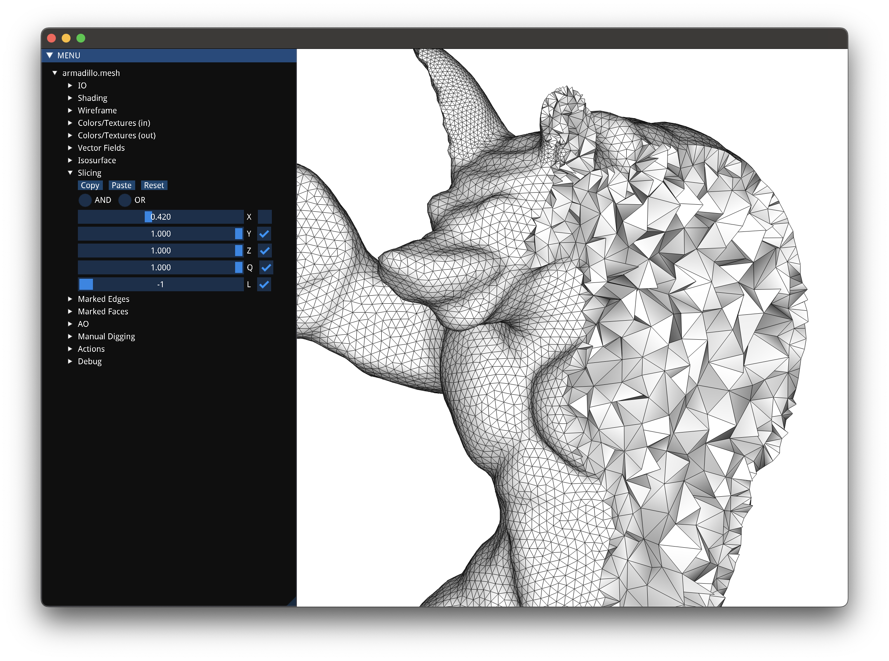

# **MeshViewer**
This is a small C++ program *- more like a shortcut -* for visualizing surface and volumetric meshes with [Cinolib](https://github.com/mlivesu/cinolib) that can be used directly from the terminal.

> Being completely based on Cinolib it can only display what Cinolib can display


<br>


## **How to get**
To use the program you must first clone Cinolib:
``` bash
git clone https://github.com/mlivesu/cinolib.git
```

Then you can build the program with the following commands:
``` bash
mkdir build
cd build
cmake .. -DCMAKE_BUILD_TYPE=Release -Dcinolib_DIR=<absolute-path-to-cinolib>
make
```

If you then want to use the program from the terminal from any location you have to run from the build folder:
``` bash
sudo cp meshviewer /usr/local/bin
```


<br>


## **How to use**
After compiling the program you can use it from the terminal:
``` bash
meshviewer -opt <path-to-model>
```
The option `-opt` can be
- `-tri` for trimeshes
- `-quad` for quadmeshes
- `-pgon` for polygon meshes
- `-tet` for tetmeshes
- `-quad` for quadmeshes
- `-phed` for polyhedral meshes
